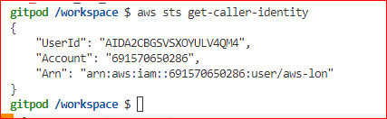
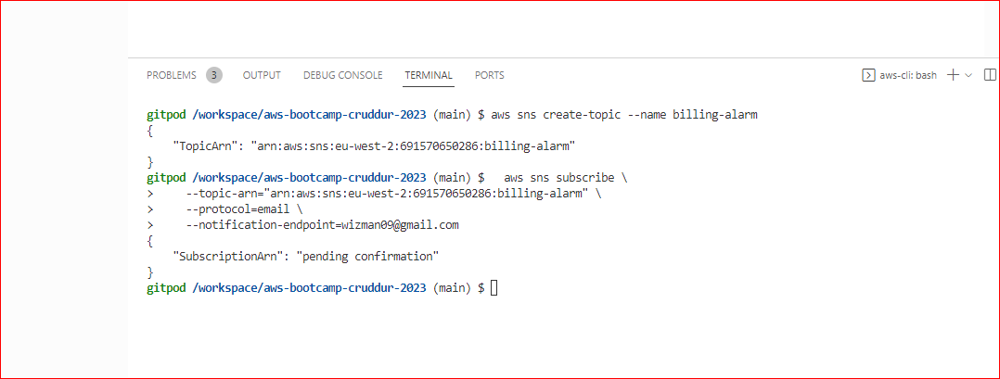
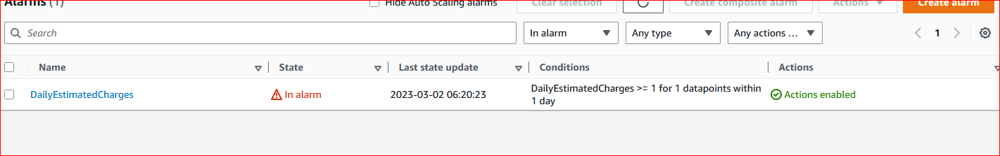

# Week 0 — Billing and Architecture

## Required Homework

### Install AWS CLI

1. Copy Template and give it a name **aws-bootcamp-cruddur-2023**
2. Install the AWS CLI reference :[**AWS CLI Install Instructions**] https://docs.aws.amazon.com/cli/latest/userguide/getting-started-install.html
3. I did uprated the `.gitpod.yml` to include the following task.

```sh
tasks:
  - name: aws-cli
    env:
      AWS_CLI_AUTO_PROMPT: on-partial
    init: |
      cd /workspace
      curl "https://awscli.amazonaws.com/awscli-exe-linux-x86_64.zip" -o "awscliv2.zip"
      unzip awscliv2.zip
      sudo ./aws/install
      cd $THEIA_WORKSPACE_ROOT
```
###Created New user and Generated credentials

1. Go to(IAM Users Console](https://us-east-1.console.aws.amazon.com/iamv2/home?region=us-east-1#/users) aws-lon create a new user
2. `Enable console access` for the user
3. Create a new `Admin` Group and apply `AdministratorAccess`
4. Create the user and go find and click into the user
5. Click on `Security Credentials` and `Create Access Key`
6. Choose AWS CLI Access
7. Download the CSV with the credentials

##Set ENV
I set credentials for the current bash terminal
```
export AWS_ACCESS_KEY_ID=""
export AWS_SECRET_ACCESS_KEY=""
export AWS_DEFAULT_REGION=eu-west-2
```
- 

Gitpod to remember these credentials if we relaunch our workspaces
```
gp env AWS_ACCESS_KEY_ID=""
gp env AWS_SECRET_ACCESS_KEY=""
gp env AWS_DEFAULT_REGION=eu-west-2
```
- 


## Creating a Billing Alarm

### Create SNS Topic

####SNS Topic

Followed the onlineresource: [aws sns create-topic](https://docs.aws.amazon.com/cli/latest/reference/sns/create-topic.html)

Create a SNS Topic
```sh
aws sns create-topic --name billing-alarm
```
TopicARN   ` "arn:aws:sns:eu-west-2:691570650286:billing-alarm"`

Created reate a subscription supply the TopicARN and our Email
```sh
aws sns subscribe \
    --topic-arn TopicARN \
    --protocol email \
    --notification-endpoint your@email.com
```
- 

Email recived and sub confirmed.
- 

#### Create Alarm

- [aws cloudwatch put-metric-alarm](https://docs.aws.amazon.com/cli/latest/reference/cloudwatch/put-metric-alarm.html)
- [Create an Alarm via AWS CLI](https://aws.amazon.com/premiumsupport/knowledge-center/cloudwatch-estimatedcharges-alarm/)
- Jason config script updated with TopiCan

```sh
aws cloudwatch put-metric-alarm --cli-input-json file://aws/json/alarm_config.json
```



## Create an AWS Budget

[aws budgets create-budget](https://docs.aws.amazon.com/cli/latest/reference/budgets/create-budget.html)


#**HOMEWORK OUTLINE

1. Destroy your root account credentials, Set MFA, IAM role - DONE
2. Use EventBridge to hookup Health Dashboard to SNS and send notification when there is a service health issue - DONE
3. Review all the questions of each pillars in the Well Architected Tool (No specialized lens) - DONE
4. Create an architectural diagram (to the best of your ability) the CI/CD logical pipeline - DONE
[Logical Diagram](https://drive.google.com/file/d/1ytWf-KxGFlCPJiKvGjrIvqfx2OoOSXjk/view?usp=sharing)
[Conceptual_Diagram](https://drive.google.com/file/d/1zEEkgdcOLmKMdPBzpRGVFFxnjinjbWut/view?usp=sharing)

5. Research the technical and service limits of specific services and how they could impact the technical path for technical flexibility - DONE
6. Open a support ticket and request a service limit - DONE

